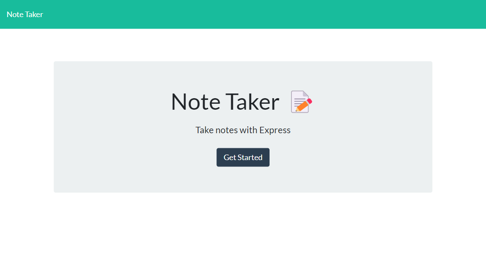
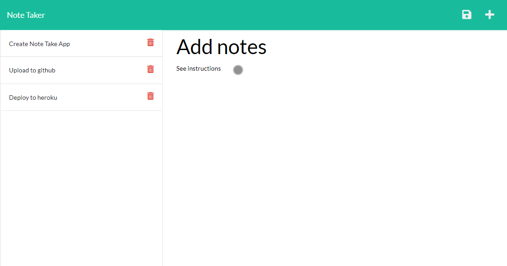

# Express.js Note Taker
  
  ## Description
  
  This app was created to allow users to write and save notes with an Express.js back end that will save and retrieve note data from a JSON file.

  The application will be deployed to Heroku.

  ## User Story

  ```
  AS A small business owner
  I WANT to be able to write and save notes
  SO THAT I can organize my thoughts and keep track of tasks I need to complete
  ```


  ## Acceptance Criteria

  ```
  GIVEN a note-taking application
  WHEN I open the Note Taker
  THEN I am presented with a landing page with a link to a notes page
  WHEN I click on the link to the notes page
  THEN I am presented with a page with existing notes listed in the left-hand column, plus empty fields to enter a new note title and the note’s text in the right-hand column
  WHEN I enter a new note title and the note’s text
  THEN a Save icon appears in the navigation at the top of the page
  WHEN I click on the Save icon
  THEN the new note I have entered is saved and appears in the left-hand column with the other existing notes
  WHEN I click on an existing note in the list in the left-hand column
  THEN that note appears in the right-hand column
  WHEN I click on the Write icon in the navigation at the top of the page
  THEN I am presented with empty fields to enter a new note title and the note’s text in the right-hand column
  ```
  
  ## Table of Contents 
  
  - [Installation](#installation)
  - [Usage](#usage)
  - [License](#license)
  - [Contributing](#contributing)
  - [Tests](#tests)
  - [Questions](#questions)
  
  ## [Installation](#table-of-contents)
  
  To install the application, download the git repository to your directory of choice and run the application by following the instructions below.
  
  ## [Usage](#table-of-contents)
  
  The application should have a db.json file on the back end that will be used to store and retrieve notes using the fs module.

    The following HTML routes should be created:

    - GET /notes should return the notes.html file.
    - GET * should return the index.html file.

    The following API routes should be created:

    - GET /api/notes should read the db.json file and return all saved notes as JSON.
    - POST /api/notes should receive a new note to save on the request body, add it to the db.json file, and then return the new note to the client. You'll need to find a way to give each note a unique id when it's saved (look into npm packages that could do this for you).
  
  What the main menu should look like:

  
  
  What the generated notes looks like:
  
  
  
  Here's a link to the herokuapp: [heroku app](https://notetakerwk11-app.herokuapp.com/).  
  
  ## [License](#table-of-contents)

  License Used: N/A
 
  ## [Contributing](#table-of-contents)
  
  If you'd like to contribute, please follow the [Contributor Covenant](https://www.contributor-covenant.org/).

  Please contribute to the project by adding issues on the links above the repo.

  ## [Tests](#table-of-contents)
  
  TBD
  
  ## [Questions](#table-of-contents)
  
  For additional questions, please reach out to:

  [GitHub: devilarms83](https://github.com/devilarms83)

  [Email: bautista.albert@gmail.com](mailto:bautista.albert@gmail.com)

